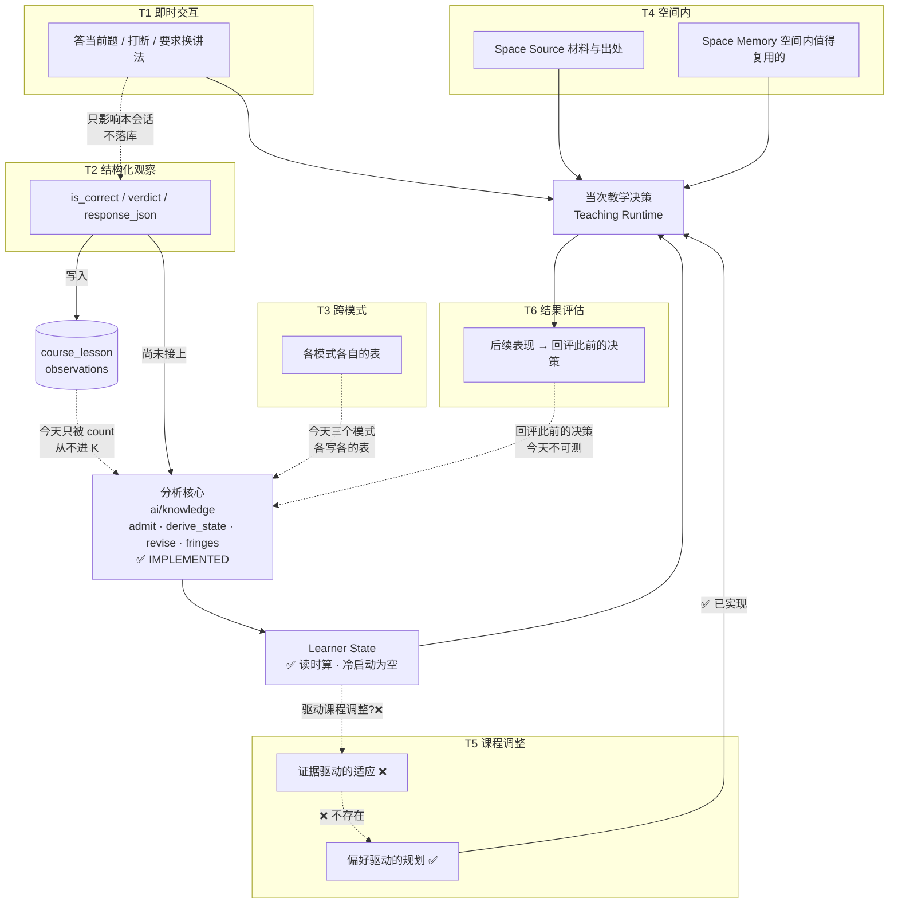

# Evidence Feedback · 证据回流

> **基线** `user-profile @ 9029e5d3` · **日期** 2026-10-10 · **状态**：现状与路线，零代码改动
>
> **上游**：`backend/ai/knowledge/PORTABLE.md`（分析核心的契约）· `LEARNER_STATE_V0.md` ·
> `SPACE_MEMORY_V0.md` · `learn-space-wiring-report.md`（接线审计）·
> `FREE_COURSE_BLUEPRINT_AUDIT.md`（课程侧数据路径）
>
> **下游**：`learn-space-space-ignition-plan.md` · `TRAJECTORY_V0_PLAN.md`
>
> **下一步（≤5 行）**
> ① **分析核心已经是 IMPLEMENTED**（`ai/knowledge/`：准入 / 推导 / 修订 / 取 fringes，有可移植性测试守着）。
> ② **但它几乎没人调用** —— 生产触发点只有 2 个，而 Free Course 的作答记录
>    **只被 `count()` 读过，从未进入这条链**。
> ③ ⇒ 第一阶段的最小闭环**不是新建机制**，是**把 Free Course 的一个字段接到已存在的入口上**。
> ④ 路线见 §9；**路线的前提是 §8 表格里那些 PARTIALLY 的格子**，不是新建表。

---

## 1 · 定义与两条原则

> **证据回流** = 把学习活动中产生的证据转化为后续教学与学习决策的依据，
> 并**通过后续结果验证这些决策**的过程。

```
Evidence Source → Interpretation → State Update / Local Action
                → Future Decision → Outcome Evidence → Evaluation
```

### 原则 A · Evidence ≠ State

三者必须分开存、分开表述：

| 层 | 例 |
|---|---|
| **Evidence** | 用户在某题答错 |
| **Interpretation** | 可能是概念没懂，也可能是算错或误读题意 |
| **State** | 「该知识点待确认困难」+ **保留证据来源** |
| **Decision** | 给针对性解释或追加练习 |
| **Evaluation** | 后续同类题能否独立做对 |

⚠️ **不能凭一次错误断言长期不会** —— 这是 §8 里 Free Course 那格标
PARTIALLY 的根因之一。

### 原则 B · State Update ≠ Learning Improvement

**记录了困难 ≠ 系统更会教了。** 只有在后续行为里观察到有意义的改善，
才能对策略有效性下判断。**短期答对 / 满意度 / 保持 / 迁移是四种不同性质的结果，
不能互相替代。**

⚠️ **本仓库当前无法区分这四者**（见 §8 的 U-2）—— 这是最该先补的测量能力。

---

## 2 · 六个功能领域

⚠️ **它们不是六种互斥的数据类型，而是证据生命周期上六个位置的「功能领域」。**
同一条记录可能同时属于 T1 和 T2；T4 的材料会参与 T5 的决策。

### T1 · Immediate Interaction Feedback 即时交互反馈

**来源**：当前题作答 · 主动追问 · 明确说不懂 · 要求换讲法 · 打断或改方向
**驱动**：**当次** Teaching Step / Teaching Runtime 的局部决策（推进 / 澄清 / 纠错 / 给支架 / 换讲法）
**边界**：区分「只影响本会话的临时信号」与「值得长期保留的证据」。**不是所有用户话语都该进长期状态。**

| | |
|---|---|
| 现状 | **IMPLEMENTED（局部）** —— 白板课有 `awaitClick`（`teaching/types.py`）与 `no_response` 超时（服务端语音那轮加的）；`useTeachingPlayback.ts:166` 的 `resolveClick()` 接收挂起并继续 |
| 缺口 | ⚠️ **点错与点对无差别** —— `resolveClick: () => void` 签名里没有参数（`useTeachingPlayback.ts:92`），被点的 key 被丢弃（`TeachingSessionView.tsx:571`）⇒ **「他卡住了」这个信号今天不存在** |
| 局部动作是否持久化 | **不必然**。绝大多数 T1 信号的终点是「继续讲」，不落库 |

### T2 · Structured Learning Observations 结构化学习观察

**来源**：正误与答案内容 · 系统判定 · 提示使用 · 重试与帮助依赖 · 可验证任务完成
**驱动**：为 Learner State 提供结构化证据

**核过的事实**：`CourseLessonObservation`（`backend/models/free_course.py:159`）
有 `kind` / `response_json` / `verdict` / `is_correct` / `feedback` 五个字段，
写入方是 `free_course_service.py:605`。

⚠️ **它的三个读取点全是 `count`**（`free_course_service.py:722`、
`free_course_events.py:553-556`）—— **没有任何一处读 `verdict` / `is_correct` /
`response_json` 去更新 Learner State。**

⚠️ 而它自己的 docstring 写着 `response_json` 是 kept **"so the learner-state
work can re-read it later"** —— **那个 learner-state work 还不存在。**

| | |
|---|---|
| 状态 | **PARTIALLY_IMPLEMENTED** —— 有数据基础、有写入、有展示计数；**闭环未打通** |
| 强调 | 单题正确率 ≠ 理解 · 作答表现 ≠ 长期记忆 · 能力判断要允许不确定与修正 |
| 最小下一步 | 让一处读取真正读 `is_correct`（见 §9） |

### T3 · Cross-Session and Cross-Mode Evidence 跨会话与跨模式

**作用**：不同学习模式在适当范围内利用已有证据，减少切换时的断裂。

⚠️ **已核实的现状**：**三个模式各自写各自的表，没有共同的证据提交面。**

| 模式 | 证据落在哪 | 是否进 Learner State |
|---|---|---|
| 对话（Global Agent） | `knowledge_evidence`（`evidence_entry.admit_outcome`） | ✅ 这是**唯一**一条 |
| Free Course | `course_lesson_observations` | ❌ 只被 count |
| 题库 | `question_attempt_service` | ❌ 不进 evidence |

⚠️ **跨模式共享 ≠ 共享全部对话历史。** 冲突、时效、来源、置信度**都还没有规则**
—— 一条都没写，不是写好了。

| | 状态 |
|---|---|
| 现状 | **PLANNED**（`SPACE_MEMORY_V0.md` 与 Global Agent 文档里只有单向的描述） |
| 待决策 | 共享哪些状态 · 冲突怎么判 · 置信度怎么表达 |

### T4 · Space-Scoped Source and Memory 空间内来源与记忆

**两个不同的东西，边界不能糊**：

| | 是什么 | 谁能写 | 生命周期 |
|---|---|---|---|
| **Space Source** | 支持回答与研究的**材料来源**、片段与出处 | 用户上传 / 系统抓取 | 跟着空间 |
| **Space Memory** | 空间内**值得持续复用**的信息 | **目前只有 Agent 的 `remember` 工具**（`conversation_tool_service.py:435-497`） | 跟着空间 |

⚠️ **Space Memory 用户没有入口** —— `user_home_service.py` 那套有确认流程，
但 space 级没有。这是控制权上的不对称，已记录在 `LEARNER_STATE_V0.md`。

⚠️ **Space Source 的检索是「按 `updated_at` 抽开头」**（`agent_context_service.py:270-303`，
总 6000 / 单源 2400 字）—— **不是语义检索**。

⚠️ **不能把来源证据、用户学习证据、空间任务状态压成一个含义模糊的 Memory 对象。**

| | 状态 |
|---|---|
| Space Source | **IMPLEMENTED**（存储 + 进 prompt，检索方式受限） |
| Space Memory | **PARTIALLY_IMPLEMENTED**（有表、有写入面、无用户入口、无检索） |

### T5 · Evidence-Driven Course Planning 证据驱动的课程调整

**作用**：让证据改变**后续课程**，而不只是显示进度。

可能的决策：补前置 · 调讲解深度与顺序 · 给某知识点加练习 · 重评某能力 ·
**只改受影响的单元而不是重生成整门课**。

⚠️ **必须区分两件常被混为一谈的事**：

| | 驱动 | 今天的状态 |
|---|---|---|
| **初始偏好驱动的规划** | 问卷四题（pace / depth / focus / volume） | ✅ **IMPLEMENTED** —— 已传进白板课（`df06a656`） |
| **真实学习证据驱动的适应** | 他实际在哪卡住了 | ❌ **NOT IMPLEMENTED** —— 没有任何代码路径从 evidence 走到 blueprint |

⚠️ **两者不能都笼统叫「个性化」然后假设效果一样。** 前者已验证能跑通，
后者的**收益未经任何测量**。

| | 状态 |
|---|---|
| 现状 | **PLANNED**（偏好侧 IMPLEMENTED，证据侧不存在） |

### T6 · Learning Outcome, Transfer, Longitudinal Evaluation 结果与长期评估

**作用**：评估**系统的决策是否有效**，而不是这一次会话顺不顺利。

必须区分的四种结果：**即时任务表现 · 理解与解释 · 新情境迁移 · 长期保持**，
外加**自评与实际表现的一致性**。

⚠️ **本仓库今天只能测第一种**（`is_correct`），而且只在课程内。
迁移与保持**没有任何测量能力**。

⚠️ **不要把方法设计里的假设写成已证实的学习规律** —— Socratic / GEB Recursive
的证据形式可以不同，但「苏格拉底式提问能提高理解」在本仓库是**假设，不是结论**。

| | 状态 |
|---|---|
| 现状 | **NOT IMPLEMENTED**（`is_correct` 之外没有；延迟后测需要跨会话时间轴，那是 Trajectory 的事） |

---

## 3 · 六个领域的关系（不是串行流程）



**图上四条必须说清的话**：

1. **局部动作不必持久化** —— T1 的大多数终点是「继续讲」。
2. **状态更新不必触发课程重生成** —— 更新状态与改 blueprint 是两件事。
3. **高层状态与课程变更都不是原始证据** —— 它们是解释的产物，
   **不能倒流当作证据喂回自己**（那会把推断当观测）。
4. **不是所有证据同权** —— 持久性、可信度、使用范围都不同。今天系统里
   **没有任何字段表达这三样**。

---

## 4 · 最小 Evidence Record（逻辑结构，非建表建议）

⚠️ **先说结论：不需要统一 schema。** 现有的三套结构各自够用，
**唯一的真实缺口是 T2 那一套没接到分析核心**（§2 T2）。

| 逻辑字段 | T2 现成字段 | T1 | T4 | 分析核心现成 |
|---|---|---|---|---|
| Evidence identity | `id` | 无（不落库） | `user_home_items.id` | `Outcome` |
| Evidence type | `kind` | — | `kind` | `admit` 的判据 |
| Source interaction | `object_id` → lesson object | — | `source_conversation_id` | `Provenance` |
| User / 作用域 | 间接（经 `object_id`） | — | `user_id` + `source_space_id` | `scope_ref` |
| 相关学习目标 | ❌ **无** | — | ❌ | 经 `knowledge_items` 间接 |
| 时间戳 | `created_at` | — | `created_at` | — |
| 原始观测 | `response_json` | — | `text` | `Provenance` |
| 解释 | ❌ **无独立字段** | — | ❌ | `admit` 返回的判定 |
| 置信度 / 不确定性 | ❌ **无** | — | ❌ | ❌ **无** |
| 作用域与许可复用 | ❌ **无** | — | 靠 `kind` 约定 | `scope_ref` 部分表达 |
| 关联的状态更新 / 决策 | ❌ **无** | — | ❌ | ❌ |

⚠️ **「相关学习目标」与「置信度」是分析核心真正需要的，而 T2 两样都没有。**
但**不要因此建新表** —— 见 §9 的第一阶段为什么不需要。

**明确不做**：不重复存整段对话 · 不要求所有来源都提供全部字段。

---

## 5 · Eval 方案（四层，各自独立成立）

⚠️ **不为整个系统设计一个总分。** 不同回流路径用与其目标匹配的方式。

### A · Evidence Capture —— 收对了吗
来源可追溯？（`CourseLessonObservation.object_id` ✅）· 观察有遗漏？
**有没有把推断存成事实**（今日最大的风险：`user_home` 的 candidate 与
confirmed 已分开 ✅，但 space 级 Memory 没有这个分层 ❌）· 同一事件重复计入？

### B · Interpretation & State Update —— 解释与状态变更合理吗
有没有证据支持 · 事实与推断是否分开 · **能否处理冲突与不确定性**
（🔴 **今天全部不能** —— 没有置信度字段）· **新证据能否纠正旧判断**
（`ai/knowledge/revise` 在结构层实现了 ✅，但**证据层的纠正路径没实现** ❌）。

### C · Decision Influence —— 真的影响决策了吗
**这条是四层里最能测的，也是今天唯一有抓手的一层**：
证据有没有被读取 · 哪项教学行为因此变了 · **没有相关证据时行为是否不同**
（最后这条是反事实，需要对照）。

### D · Outcome Evaluation —— 改了之后结果变了吗
即时效果（`is_correct` 可测）· 相似题的独立表现（🔴 需要跨课节追踪）·
新情境迁移（🔴 无）· 延迟保持（🔴 无，且需要跨会话时间轴）。

⚠️ **需要对照的个性化与学习方法，必须记录基线、对照条件、结果与未验证假设。**
⚠️ **「系统执行了适应」≠「适应成功」** —— 这两句话在本仓库都还没有证据。

---

## 6 · 成熟度表

| 领域 | 证据来源 | 现有实现 | 当前限制 | 回流去向 | 最小下一步 | Eval | 状态 |
|---|---|---|---|---|---|---|---|
| **T1** | 当次交互 | `awaitClick` + `no_response`（白板课） | **点错与点对无差别**（`resolveClick: () => void` 无参） | 当次教学决策（不落库） | 给 `resolveClick` 传 key，比对 `clickTarget` | C：点错后行为是否不同 | **PARTIALLY_IMPLEMENTED** |
| **T2** | 课程作答 | `course_lesson_observations` 五字段 + 写入（`:605`）+ 计数展示 | **三个读取点全是 `count`**，从不进分析核心 | 目标：Learner State | **让一处读取读 `is_correct`**（§9） | C：读了之后下一次教法变了吗 | **PARTIALLY_IMPLEMENTED** |
| **T3** | 跨模式 | 三套独立的表 | **无共同提交面 · 无冲突规则 · 无置信度** | 目标：共享认知底座 | 先定义「哪些状态共享」（不做实现） | — | **PLANNED** |
| **T4a** | 空间材料 | Space Source 存储 + 进 prompt | **检索是抽开头，不是语义检索** | 当次回答的依据 | 若要语义检索需另立计划 | A：来源可追溯 ✅ | **IMPLEMENTED**（检索受限） |
| **T4b** | 空间记忆 | `remember` 工具可写 | **用户无入口 · 无检索** | 进当次 prompt | 用户可见的增删改（对照 User Home 的做法） | A：用户能删吗 | **PARTIALLY_IMPLEMENTED** |
| **T5a** | 偏好问卷 | 四题 → blueprint（`df06a656`） | 无 | 初始规划 ✅ | — | C：已实现 | **IMPLEMENTED** |
| **T5b** | 学习证据 | — | **不存在** | 应到课程调整 | 见 §9 第二阶段 | D：需要对照 | **NOT IMPLEMENTED** |
| **T6** | 后续结果 | `is_correct`（仅课程内） | 迁移 / 保持**无任何测量能力** | 回评此前决策 | 相似题独立表现（需要跨课节 id） | D | **NOT IMPLEMENTED** |
| **核心** | 分析核心 | `admit` / `derive_state` / `revise` / `compute_fringes` + 可移植性测试 | **生产触发点只有 2 个** | Learner State | 增加触发点 | 全链路 | **IMPLEMENTED**（被调用不足） |

### 未验证项（不做结论）

| | 什么 | 影响 |
|---|---|---|
| **U-1** | Free Course 的 `is_correct` 语义质量（LLM 判的开放题 vs 本地判的客观题） | 🔴 影响 T2 的可用性判断 |
| **U-2** | 四种结果（即时/理解/迁移/保持）**无法区分** | 🔴 §5 的 D 层因此不可测 |
| **U-3** | T5b 的收益 —— 「按证据调整课程」是否真的更好 | 🔴 连基线都没有 |
| **U-4** | 三套结构里是否存在重复计数（同一件事被记两次） | 🟡 |

---

## 7 · 已有权威文档与本文件的分工

| 文档 | 负责 | **不**负责 |
|---|---|---|
| `backend/ai/knowledge/PORTABLE.md` | 分析核心的**可移植契约**（依赖边界、拷贝步骤） | 证据从哪来 |
| `LEARNER_STATE_V0.md` | Learner State **是什么、怎么算** | 证据怎么进 |
| `SPACE_MEMORY_V0.md` | Space Memory 的**规划与边界** | 跨模式共享规则 |
| `FREE_COURSE_V3.md` | 课程**生成管线** | 证据回流 |
| **本文件** | 证据**从产生到影响决策**的整条链 + 成熟度 + 路线 | 上述任何一项的内部定义 |

⚠️ **不重复定义** Learner State、Space Source、Space Memory、Global Agent。
⚠️ `docs/evidence/` 那四份（01-overview…04-now-and-gaps）**不在版本控制**
（`.gitignore` 的 `/docs/*`）⇒ **团队看不到**；本文件是它的 tracked 对应物，
但**不替代**它对证据层内部契约的描述。

---

## 8 · 路线

### 第一阶段 · 一次作答 → 一次教学变化（**唯一的最小闭环**）

| | |
|---|---|
| **目标** | 让 T2 的数据**第一次真的进分析核心**，且下一次教学能看到它 |
| **候选路径** | `CourseLessonObservation` → `evidence_entry.admit_outcome` → Learner State → 下一次教学 |
| **支持这条路径的证据** | ✅ `admit_outcome` 存在（`evidence_entry.py:141`）· ✅ `record_evidence` handler 已完整（`conversation_tool_service.py:499-701`）· ✅ `derive_state` 每轮重算并进 prompt（`agent_context_service.py:501`）· ✅ `is_correct` 有值 · 🔴 **但 `resolve_item` 要求知识结构已存在，而新课程没有** |
| **依赖的现有组件** | 分析核心（零改动）· 知识结构（🔴 **需先能写入**）|
| **最小补齐** | ① 让 Free Course 的判定走一次 `admit_outcome` ② **给课程一个知识结构**（否则 `resolve_item` 必失败，见 `FREE_COURSE_BLUEPRINT_AUDIT.md` 同款门禁） |
| **验收** | 一次答错后，**下一轮教学能看到该知识点处于待确认状态**；答对后该状态消失 |
| **能验证** | §5 的 **A / B / C** 三层 —— 特别是 C：这道题的证据有没有真的改变下一次教法 |
| **仍然不能声称** | ❌ 学习效果提升（要 D 层）· ❌ 迁移 · ❌ 保持 |
| **明确不做** | 知识追踪算法 · 长期记忆调度器 · 认知建模框架 · Agent 协作架构 |

⚠️ **这个阶段的真正阻塞不是「缺一个回流机制」，而是「新空间没有知识结构」** ——
与 `learn-space-wiring-report.md` 的 BL-1 是同一件事。

### 第二阶段 · 让证据改变课程（不做）

需要 U-3 的基线设计先写出来，否则无法判断收益。

### 第三阶段 · 跨模式共享（不做）

需要先回答「哪些状态共享」，而那个问题目前**一个规则都没写**。

---

## 9 · 下一个可以直接开工的最小任务

**任务名**：让一次课程作答进入 Learner State（只做 `is_correct`，不做别的）

| | |
|---|---|
| **落点** | `free_course_service.py:605` 写完 observation 之后，把 `is_correct` 提交给 `evidence_entry.admit_outcome` |
| **前置** | 🔴 该课程对应的 `knowledge_items` 必须存在（否则 `resolve_item` 返回 `unknown_item`，不写） |
| **不做** | 不新增表 · 不改 prompt · 不改 UI · 不碰 T1/T3/T5 |
| **验收** | ① 答错后该 item 在 Learner State 变为待确认 ② 答对后恢复 ③ **同一事件不被重复计入** ④ `pytest` 与 `vitest` 全绿 |
| **失败时说明** | 若因「课程无知识结构」而无法写入 ⇒ **那说明该先做知识结构写入面**（即 BL-1），而本任务降级为一个读侧断言 |

⚠️ **这个任务的验收第 ④ 条是刻意的**：如果它只能通过 mock 通过，
那说明还没碰到真实闭环。